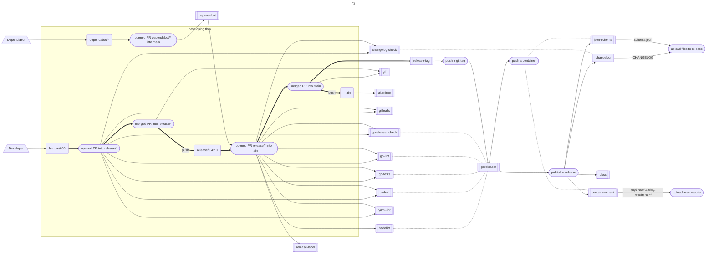

# GitHub actions for helmwave

```mermaid
---
title: CI
---
flowchart LR;
    Developer[/Developer\] --> feature/000
    DependaBot[/DependaBot\] ---> dependabot/*

    feature/000(feature/000)
    release/0.42.0(release/0.42.0)
    main(main)
    dependabot/*(dependabot/*)

    changelog[[changelog]]
    changelog-check[[changelog-check]]
    codeql[[codeql]]
    container-check[[container-check]]
    dependabot[[dependabot]]
    docs[[docs]]
    gif[[gif]]
    git-mirror[[git-mirror]]
    gitleaks[[gitleaks]]
    go-lint[[go-lint]]
    go-tests[[go-tests]]
    goreleaser[[goreleaser]]
    goreleaser-check[[goreleaser-check]]
    hadolint[[hadolint]]
    json-schema[[json-schema]]
    release-tag[[release-tag]]
    release-label[[release-label]]
    yaml-lint[[yaml-lint]]


    push_tag([push a git tag])
    publish_release([publish a release])
    upload([upload files to release])
    upload_security([upload scan results])
    push_container([push a container])


    opened_pr_release_into_main([opened PR release/* into main]) --> release-label & hadolint
    opened_pr_dependabot_into_main([opened PR dependabot/* into main]) --> dependabot --> opened_pr_release_into_main
    opened_pr_to_release([opened PR into release/*])
    opened_pr_release_into_main & opened_pr_to_release ----> codeql & gitleaks & go-lint & go-tests & goreleaser-check & yaml-lint & changelog-check

    merged_pr_to_main([merged PR into main])
    merged_pr_to_release([merged PR into release/*])
    merged_pr_to_release & merged_pr_to_main ---> gif


    subgraph developing flow
        direction LR;
        dependabot/* --> opened_pr_dependabot_into_main
        feature/000 ==> opened_pr_to_release ==> merged_pr_to_release == push ==>
        release/0.42.0 ==> opened_pr_release_into_main ==> merged_pr_to_main == push ==>
        main
    end

    main --> git-mirror

    merged_pr_to_main ====> release-tag --> push_tag --> goreleaser

    goreleaser -->  publish_release & push_container

    goreleaser-check & go-lint & go-tests & codeql & hadolint  <-...- goreleaser
    changelog-check <-.- changelog
    push_container <-..- json-schema & container-check


    publish_release --> changelog
    publish_release --> container-check
    publish_release --> json-schema
    publish_release --> docs


    json-schema -- schema.json --> upload
    changelog -- CHANGELOG --> upload
    container-check -- snyk.sarif & trivy-results.sarif --> upload_security


```
