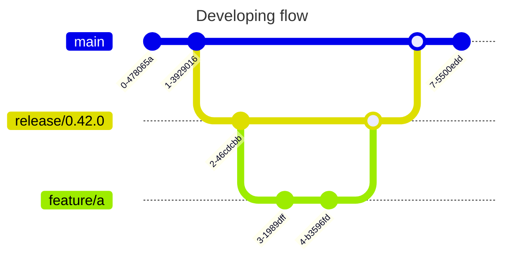

# Contributing Guidelines

The 🌊 HelmWave project accepts contributions via GitHub pull requests. \
This document outlines the process to help get your contribution accepted.

## Milestones

We use milestones to track the progress of specific planned releases.

## Versioning

We use [semver](https://semver.org/)

## Developing flow

*fix/feature-branch --> release/$SEMVER --> main*

**Example:**

- bugfix/000 --> release/0.40.1 --> main
- feature/000 --> release/0.41.0 --> main

### Non product update

When don't affect any `*.go` files we use [githubFlow](https://docs.github.com/en/get-started/quickstart/github-flow).

`some branch --> main`

### Documentation update

After merging new release branch (minor or major) a new branch and PR in [helmwave/docs](https://github.com/helmwave/docs) will be created automatically. You will need to update documentation (if necessary) and merge this PR into main branch.

### CHANGELOG

We use https://changie.dev to provide changes for users.

Just install this tool

`$ changie new` – it helps you write the changes

## How to build?

https://docs.helmwave.app/latest/install/#compile-from-source

## Pre commit

We use https://pre-commit.com for git hooks

## How to upgrade golang version?

> change a version in next files:

1. [go.mod](go.mod)
2. [Dockerfile](Dockerfile): GOLANG_VERSION=1.21

## How to upgrade alpine version?

> change a version in next files:

1. [Dockerfile](Dockerfile): ALPINE_VERSION=3.21
